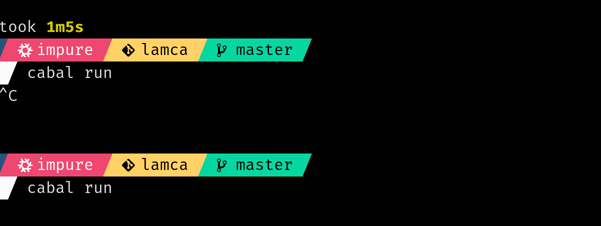

# Lamca
Lambda Calculus Calculator written in haskell. Nothing new.

To run it:
```
nix develop github:WhiteBlackGoose/lamca --command cabal run
```



## Syntax

The following are examples

One variable:
```
x
```

Application of `y` to `x`:
```
xy
```

Abstraction:
```
\x.x
```

Application of `y` to abstraction `\x.x`:
```
(\x.x)y
```

## Interactive

```
a expr expr
b expr
e expr
v expr
sub x expr expr
```
